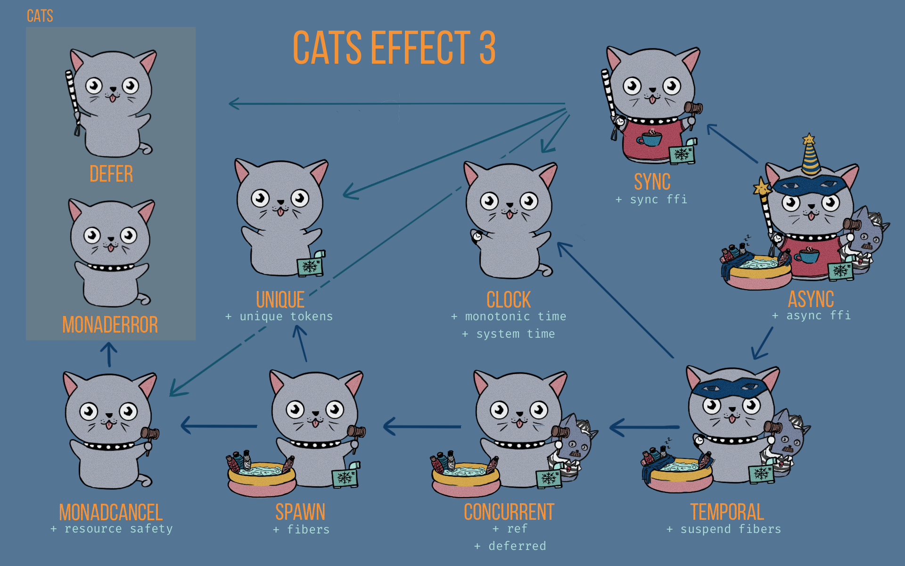

## Effect Systems

  * [Introduction](#introduction)
  * [The IO Monad](#the-io-monad)
  * [Cats Effect](#cats-effect)
  * [Cats Effect Ecosystem](#cats-effect-ecosystem)
  * [Cats Effect Thread Pools](#cats-effect-thread-pools)
  * [Concurrency in Cats Effect](#concurrency-in-cats-effect)


---

### Introduction

As we saw earlier, in Pure Functional Programming we treat a program as a giant expression that computes a single value through functions. A pure FP program does not produce any side effects; this means that we apply the substitution principle, where we can replace a function with the value that it produces. 

```scala

def sum(a: Int, b: Int): Int = a + b

val three = sum(2, 1)
val sum21 = 2 + 1
val sum21result = 3

```

This property is what we called **Referential Transparency**. An expression is said to be referentially transparent if it can be replaced with its corresponding value without changing the program’s behaviour.


The problem is that in the real world, side effects are everywhere (printing to the console, calling an external service, connecting to a database, logging, etc.).

The issue then is that a side effecting function is NOT referentially transparent, and thus we can't replace the function with its value. 

```scala
val printLine: Unit = println("Helo World")
// This expresses the act of printing, with returns Unit --> returns (), not the same as above 
```

An `Effect` is a data type that encapsulates the concept of a side effect in a way that we can treat it as a referentially transparent way. That means that we can pass them as values. Effect Systems provide a type signature that describes what the side effect will eventually do, without doing it yet. We have a description of what is going to happen, separate from the execution, which means they are lazy in their execution model. 

Examples of Effect types that you already know

```scala
val maybeHello: Option[String] = Option("Hello") // This describes an effect where it's possible that there is no value
```

Other effects are `Either` (possibility of an error), `Future` (asynchronous computation), etc. 

When talking about `Effect Systems` it is very common to express them with higher-kinded-types --> `F[_]`. When you see this notation, it's reasonable to read it as "an effect of type `F` that describes any impure computation".

---

#### Purely Functional I/O

The problem with `Future` is that it is an effect system that cannot wrap side effecting computations and still remain referentially transparent. In that case, we cannot apply the substitution principle, and programs become much harder to reason about. A `Future` is eager in its execution model, so once the code hits the line where the `Future` is defined, it is running in a thread from the thread pool; there is no way to stop it (maybe interrupt the execution, but that is ugly), and there is no way to defer the execution of this computation for later. 

What we desire in these cases is a purely functional I/O abstraction, where we can defer the execution "until the end of the world" (usually the main program), and describe all the pieces of my software with referentially transparent values (functions). This will allow us to build more complex interactions by just composing the different pieces; with a powerful type system like the one in `Scala` it is possible to build very robust, complex and yet correct abstractions following this model.

---

### The IO Monad

Originally implemented in languages like `Haskell`, a pure functional language. Any operation that deals with I/O will have a return type of `IO` (in addition to this, there are other restrictions on how it gets used). In `Scala` this is obviously not the case, and we have to use libraries in order to implement similar behavior.  

But why would we want to do this? 

First, we saw in previous chapters how the `Future` API had some issues with regards to referential transparency and reasoning of the code. Changing where we write a `Future` changes the way the program behaves. The `Future` abstraction is used to model an asynchronous computation (i.e. HTTP request, database query, etc.); **it models concurrency, not parallelism**. In a concurrent situation, where things are happening at the same time, it is many times very important to know when things are being executed, and have some control about when and how computations are run (including being able to cancel them).

In `Cats Effect`, the `IO` data type encapsulates any computation that can produce side effects. The trick here is that we can then treat our functions defined with `IO` as if they were referentially transparent, _until we execute them_. Most of our code will be declarative, descriptive of what it needs to do. As such, easily testable too. Only when our full program is composed, we run it (this will "unwind" the `IO` Moand contents and execute side effects like logging, executing web service calls, etc.) 

**Martin Odersky**: _"The `IO` monad does not make a function pure. It just makes it obvious that it's impure"_

#### Creating IO 

There are several ways to do this, depending on your initial data structure. 

If the value is already executed or it is for example a primitive, we can "lift" the value into an `IO` by doing

```scala
val ioHello: IO[String] = IO.pure("Hello World")
```

Why would we want to encapsulate primitive or executed values into an `IO`? Remember, `IO` is a Monad, which means we can do sequential computations on them; having several `IO` that I can chain together will allow me to express more complex programs. The `pure` method should be used only when the value is already computed (`pure` is evaluated eagerly) 

For other values, we can use the apply method, like any other Scala object

```scala
val a: IO[Unit] = IO(println("Hello World")) 
```

Note the side effect of printing here. This is not running yet, its execution is deferred. Because `IO` is a Monad, we can chain this value with others; and because it is lazily executed, we can control when this print line operation happens. 

In contrast with `pure`, we can also wrap values into an `IO` by using the `delay` method. This method defers the execution of the wrapped expression for later

```scala
val delayed: IO[Int] = IO.delay{
  println("Printing a number")  
  100
}
```

In general, it is safer to use `IO.delay`, especially if we don't know whether the wrapped value produces side effects or not. 

Execution of `IO` is done "at the end of the world" (i.e. the main program). For example

```scala
import cats.effect.IOApp
import cats.effect.unsafe.implicits.global
import cats.effect.IO
import java.time.Instant

object MyApp extends IOApp.Simple:

  def printTime: IO[Unit] = IO.println(Instant.now().toString())

  override def run: IO[Unit] =
    (for {
      _ <- printTime
      _ <- IO.println("Starting...")
      _ <- IO.println("Completed...")
      _ <- printTime
    } yield ())

```

---

### Cats Effect

`Cats Effect` is a big library that introduces many new concepts and typeclasses for working with an Effect System. It provides an asynchronous runtime that other libraries or custom application code build on top of. It can be thought of an alternative to `Akka`, though there are many differences in its approach and design. At the end of the the day `Cats Effect` is a library that provides tools for asynchronous concurrent and parallel code on the `JVM` and `JS` runtimes.



(credit: [impurepics](https://impurepics.com/))

---

### Cats Effect Ecosystem

The ecosystem built on top of `Cats Effect` is impressive. Many of the libraries that are built on top of it have been battle tested in production at scale. Some of the more important ones are: 


* [FS2](https://fs2.io/#/) --> Functional, effectful, concurrent streams for `Scala`. The `FS2` ecosystem includes extensions such as [`FS2-GRPC`](https://github.com/typelevel/fs2-grpc) and [`FS2 Kafka`](https://fd4s.github.io/fs2-kafka/)
* [Http4s](https://http4s.org/) --> Typeful, functional, streaming HTTP for `Scala`
* [Doobie](https://tpolecat.github.io/doobie/) --> Pure functional layer for `Scala` and `Cats`
* [Log4Cats](https://github.com/typelevel/log4cats) --> Referentially transparent logging
* [otel4s](https://typelevel.org/otel4s/) --> [OpenTelemetry](https://opentelemetry.io/) implementation for `Scala`
* [Scala Steward](https://github.com/scala-steward-org/scala-steward) --> A bot that helps keep your library dependencies, sbt plugins, and `Scala` and sbt versions up-to-date

---

### Cats Effect Thread Pools

---

### Concurrency in Cats Effect

---

#### Fibers


