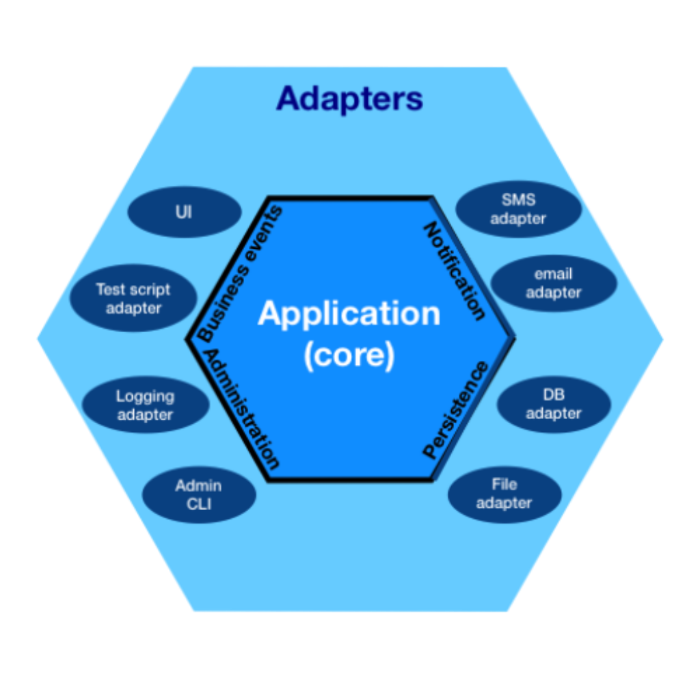

## Functional Design

   * [Error Handling](#error-handling)
   * [FP Design Principles](#fp-design-principles)
   * [Functional Programming and Domain Driven Design(DDD)](#functional-programming-and-domain-driven-design-ddd)
   * [Clean Software Architecture for FP](#clean-software-architecture-for-fp)
   * [Dealing with Side Effects](#dealing-with-side-effects)
   * [Tagless Final Encoding](#tagless-final-encoding)
   * [Designing Functional Domain Models](#designing-functional-domain-models) 

---

### Error Handling

Functional Programming is like writing a series or algebraic equations (more on that later), and in Algebra you don't use null values or throw exceptions, so you don't use those when writing FP code. One of the main advantages of a functional language like `Scala` is that there are no null values or exceptions. This statement surprises `Java` developers that are new to `Scala`, but it holds true: In `Scala`, there are no `NullPointerException` errors (of course, they can still appear when using `Java` libraries). This doesn't mean that programs cannot fail, so we need a way to model errors and exceptions in our code. There are three main categories of errors: absence of values, operations that can fail, and 

* `Option`: modeling absence of values ("null")

This is modeled in Scala with the `Option` type. This is a type constructor, `Option[A]` where `A` is some other type in your code. It can take two values: 
- `None` represents the absence of a value. This is a type safe way to represent null values, but without the baggage that null has. It is a sound type that can be combined with other types (it is an `Option`)
- `Some` is the monadic wrapper around the value that is expected (A). If the value exists, we return a wrapper that encapsulates it. 

These two flavors of `Option` allow us to do flatMap, for-comprehensions, pattern matching, etc. in our code, following a seamless FP approach to data transformations and manipulation, even if the values are absent. There is one downside to using Option, and that is that it swallows the error if one exists, it is not returned to the user. 

For example, in the following code we know that we get a `None` when the divisor is zero, but no error is communicated back to the user. 

```scala
def divide(a: Int, b: Int): Option[Int] = 
 if b == 0 then
   None
 else
   Some(a / b)
```

* `Try`: modeling things tha can fail (with exceptions)

This is a clean way to handle exceptions, and this type is used a lot when interfacing with `Java` libraries to improve their ergonomics. Try also has two possible values: 

- `Success`: a wrapper around the successful value. If the computation completes without error or exceptions, we wrap the value into a monadic wrapper that represents that it completed successfully. 
- `Failure`: a wrapper that carries some information about the reason for why this computation failed. 

```scala
import scala.util.Success
import scala.util.Failure
import scala.util.Try

def divide(a: Int, b: Int): Try[Int] =
  if b == 0 then 
    new Failure(throw new ArithmeticException("Divide by zero is not allowed"))
  else 
    Success(a / b)
```

* `Either`: Exception-less error handling

`Either` is a type that represents two mutually exclusive values, one being an error and the other one being a successful copmutation

- `Left`: by convention, this is the error value
- `Right`: successful computation

Both are monadic wrappers around the types that Either represents. This constructor type has the following generic signature

`Either[E, A]` where `E` represents the error type and `A` represents the result

`Either` allows us to represent any _domain errors_ in a very concise way, adding logic to our functional APIs when we need to convey to the user that a certain computation should be treated as an error. 

Tip #1: don't use generic types for domain errors. Domain errors should be types that reflect your domain (i.e. `InvalidUserInput` as opposed to something like a `Failure`)

Tip #2: as we saw in previous examples, there are more advanced ways to perform validation on values that encapsulate the notion of an "error", which allow combining errors through an _Applicative Functor_. In the `Cats` library, one such type was `Validated`. We've included here only the types that come with the standard library but keep in mind that depending on the use case, more elaborate types might be useful. 

---

### FP design principles

* **Purity**

A Pure function is a function that always returns the same output when called with the same arguments. This is a function with no side effects. Functions that are pure lead to programs that are referentially transparent, that is, they can be replaced with its corresponding value without changing the program's behavior. This allows for more robust, easier to reason about and maintain programs (with less bugs, too!)

* **Immutability**

This property means that once you assign a value to something, it cannot be changed. Immutability is a core principle of functional programming, and it eliminates a whole class of issues related to state management. This approach makes it much easier to reason about concurrent and / or parallel programs. If a function is immutable it means that it cannot be changed "from the outside", and thus it is a lot easier to reason about what it is doing. 


* **Disciplined State**

AVOID SHARED MUTABLE STATE!!!. If there is one principle to follow, this is it. Shared mutable state cannot be reasoned about easily, is the source of most software bugs out there, and is very hard to maintain. State should be local to your function, and the Single Writer Principle should be observed (a good example of this is Akka's Actor system with its Persistent Actors)

* **Fist class functions and Higher-order functions**

Functions in FP are first-class citizens. They can be passed around as parameters or become the return type of another function. They can be stored inside data structures or assigned to variables. A _Higher-order function_ is a function that takes one or more functions as arguments or returns a function as a result (i.e. `map`, `flatMap`, etc)

* **Type Systems**

A type systems help the compiler in making sure that you have the right types as arguments, return types, etc. A strong type system removes a whole class of bugs from your consideration, which means you have to write less tests. The compiler prevents you from making small but frequent (and sometimes very costly) mistakes. Some compilers like the `Scala` or `Rust` compilers are more advanced and will prevent you from introducing more advanced bugs. Another benefit of a strong type system is that you have implicit documentation, by reading the type signature of your functions you _know_ what the program is doing, or what is allowed in your function. 

* **Referential Transparency**

An expression is said to be referentially transparent if it can be replaced with its corresponding value without changing the program’s behaviour.

This requires functions to be pure. Referential Transparency is a desired trait, because it allows for better composition, from small pieces to a large system. Pure functions can be heavily optimized by the compiler, making your code faster. In essence, your code is faster, easier to read and maintain, and has less bugs. 

---

### Functional Programming and Domain Driven Design (DDD)

While DDD got popularized mostly in the context of Object Oriented frameworks (i.e. .NET) it turns out that FP is a good fit for this Software Design approach. 

Concepts like `Value Types` map very well to functional programming. They are immutable by design, which is a direct fit to a core principle in FP. Other DDD software constructs also map very well to FP:

- An `Entity` has a lifecycle. While FP promotes immutability, that does not mean that data does not change. We just make copies of that data to create new _versions_ of our data structure. Entities can be modeled in FP with a high degree of sofistication, i.e. by implementing Finit State Machines. The Actor model in Akka is a perfect example of this. 

- An `Aggregate` needs to be thought of as a transactional boundary. It is very important to avoid the pitfalls of distributed transactions, something which we have learned doesn't work well in modern systems. In a distributed system, it's very important to delineate the transaction boundary to happen within one machine, to avoid this problem. This is accomplished very well by leveraging Akka's Persistence Model for example (single writer principle). At the same time, we should not make any assumptions on where these aggregates are running, since they can be spread out in a cluster (location transparency). Another pitfall in DDD, especially when using microservices, is to share different aggregate models just because they share the same "data". Encapsulation, separation of responsibility and isolation in data are very important and FP can help with delineating these concerns. 

- Some advanced concepts in FP have direct applicability in DDD. For example, for nested data structures that need updating, we can use _Lenses_ (out of scope for this discussion); or we can use _Monoids_ for `Value Objects`, since they will need to be combined with each other in many cases. 

- As we will see in a future section, we can use Property Based Testing to prove the domain properties, expanding our testing surface area by leveraging FP concepts. 

As a general rule of thumb - we will expand on this shortly - keep your side effects at the edge of your system. You can use an imperative shell and a functional core as your design approach to accomplish this. 


---

### Hexagonal Architecture

When a system reaches a certain size, Software Architecture is everything. A system with poor architecture (or no architecture at all) will not scale or perform, and given enough time will be a nightmare to maintain. This is true for both monolithic applications as well as distributed architectures such as those based on microservices. 

_The Hexagonal Architecture, also known as "Ports and Adapters" is an architectural pattern used in software design. It aims at creating loosely coupled application components that can be easily connected to their software environmente through ports and adapters. This makes components exchangeable at any level and facilitates test automation._  (Wikipedia) 

This pattern was invented by Alistair Cockburn in 2005 to avoid common pitfalls in OO design, such as undesired dependencies between layers and contamination of user interface code with business logic. 

The hexagonal architecture divides a system into several loosely-coupled interchangeable components, such as the application core, the database, the user interface, test scripts and interfaces with other systems. This approach is an alternative to the traditional layered architecture.

Each component is connected to the others through a number of exposed "ports". Communication through these ports follow a given protocol depending on their purpose. Ports and protocols define an abstract API that can be implemented by any suitable technical means (e.g. method invocation in an object-oriented language, remote procedure calls, or Web services). 

The term "hexagonal" can be a bit confusing, it references the typical graphical representation of this architecture




Some people consider the Hexagonal Architecture the origin of the Microservices Architecture, and while HA is more relevant for a monolith, its concepts are important in a distributed system as well. 

Why are we even talking about this Software Architecture?. I think one of its main contributions is to see how the layers in the software have an explicit _lack_ of dependency. The core is the domain, and in our world it should be made of pure functions, with Property tests that can run in memory. This is where all my logic should reside. I might compose some of these functions following DDD approach into Entities, Value Objects, Aggregates, etc. I should be able to express a Bounded Context in this application core, with no regards to any side effects. The application core should be as referentially transparent as possible, and adopt FP principles. 

Every time you need to interact with something from beyond of your application logic you need to group these actions and describe them in a port. The port is the edge of hexagon and it should be an integral and essential part of your application. 

At the edge of my system, I will have some dependencies (databases, other web services, etc) which is where I will need to execute my side effects. These are modeled as adapters that represent the technology you are interfacing with. The application core doesn't know anything about the adapters. The dependencies flow from the inner layers to the outside, where the outside layers have a direct dependency from the immediate layer below it, but no further. This approach allows good separation of concerns and is still valuable when designing systems with an FP approach. 

Tip: `Scala` is uniquely positioned in that it is a hybrid language that mixes FP and OO. Object Oriented approach is very useful to compose large parts of an application (components) into packages, modules, etc. Even within a microservices it is very common to have code that needs to be separated into modules. Scala offers a unique opportunity to mix the functional approach in the small (where my low level core domain resides) and apply object oriented principles in the large, where I need to put together a set of modules that need to work together.  


---

### Dealing with Side Effects

In Functional Programming, we try to use pure functions that can be treated as expressions (values). As we have seen, Referential Transparency is a nice property to have. But what happens when we need to have side effects?. One way FP deals with this is to use _Effect Systems_. These are usually offered as libraries that allow you to write programs than encapsulate side effects, and treat them as values. At the edge of the system, these side effects are run. These Effect Systems are usually Monads that allow composition, for-comprehensions, etc. They are also usually expressed as a set of Type Constructors that encapsulate the values that we want to compute and sometimes also the possible error types. The idea with Effect Systems is that they defer the execution on the program until "the end of the world" (the main function).

Effect Types are a very effective way to describe a computation that has side effects, but without executing it immediately. Two of the main Effect Systems in Scala are implemented in the `Cats-Effect` and `ZIO` libraries. 

`Cats-Effect` is based on the `IO` Monad

```scala
def sleepPrint(word: String, name: String, rand: Random[IO]) =
  for
    delay <- rand.between(200, 700)
    _     <- IO.sleep(delay.millis)
    _     <- IO.println(s"$wordm $name")
  yield ()  
```

`ZIO` is a functional effect with the following type signature: `ZIO[R, E, A]` where:

- `R` is the Environment Type, it represents contextual data that is needed by the effect system before it executes

- `E` is the failure type and represents the type of error that the effect can fail with when executed. 

- `A` is the success type and represents the value that the effect can succeed with. 


---

### Tagless Final Encoding

Tagless Final is a pattern that tries to solve the [Expression Problem](https://en.wikipedia.org/wiki/Expression_problem). The goal is to define a data abstraction that is extensible both in its representations and its behaviors, where one can add new representations and new behaviors to the data abstraction while retaining type safety. 

There are formal definitions and tutorials on how we get to Tagless Final Encoding, [here](https://blog.rockthejvm.com/tagless-final/) is a good one. 

For our purposes, we are going to assume that we will define our generic interface with higher-kinded types, and that we will abstract out the type effect used. For example, in the following API:

```scala
trait UserApi[F[_]]:
  def add(user: User): F[Option[User]]
  def get(id: UserId): F[Option[User]]
  def remove(id: UserId): F[Unit]
```

Our trait is decorated by a constructor type `F` that takes some argument inside of it. The type F itself is generic, and usually represents an effectful computation or effect system. It could be a `Future`, `IO` Monad, `ZIO` type, etc. 

These interfaces will have concrete implementations, but we code our programs to the generic types, sometimes specifying certain constraints about the F effect type. For example, if we want to limit the `F` type to be a `MonadError` from the `Cats` library:

```scala
trait UserApi[F[_]: MonadError]
  def add(user: User): F[Option[User]]
  def get(id: UserId): F[Option[User]]
  def remove(id: UserId): F[Unit]
```

This API will have more concrete (and constrained) _properties_ that are inherited by the fact that we are using a `MonadError` typeclass. 

This idea of _properties_ is important, these are algebraic properties is we use the correct algebraic data types (like product and sum types). Your API, all the sudden, has mathematical properties (remmeber for example, that one of the `Monad` laws is that they are associative). This allows you to _prove_ that your software follows some properties in a very generic and powerful way. The idea behind this approach is that the APIs that you design follow the laws of the domain. 

---

### Designing Functional Domain Models

In FP a module is a combination of functions that operate on certain data types and that follow a set of _invariants_ known as domain rules. In mathematical terms this is known as the _Algebra_ of the module. 

#### Algebras

An Algebra in this context is (Functional and Reactive Domain Modeling, Ghosh 2017): 

* One or more sets, in our case the sets are the data types that form part of the model
* One of more functions that operate on the objects of the sets, in our case these will be the functions that you define and publish as the API to the user. 
* A few axioms or laws that are assumed to be true and can be used to derive other theorems. When you define your operations in an API, the laws will specify the relationships between these operations. 

Why are some of the advantages of this approach?

For one, it describes in a concise way the behavior of your system, without polluting it with long class hierarchies. Behaviors is what we are interested in, as they define what the domain needs to do. In addition to this, because our algebraic functions are composable, it is possible to create larger abstractions out of these building blocks. And finally, given that there are laws that govern how these APIs need to function, our domain models are much more verifiable. 

These Algebras become a very precise contract for the user (the developer that uses our API)

#### Interpreters

An Algebra by itself is not sufficient to create programs, they use generic abstractions. The Algebras are blueprints, but in order to execute the functions that they describe, they usually need an _Interpreter_. The Interpreter consists of concrete classes and functions that implement the API defined in the Algebra. 
